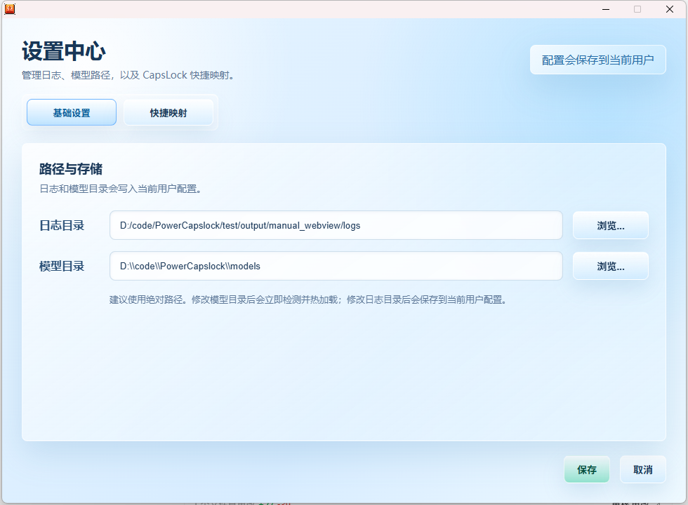
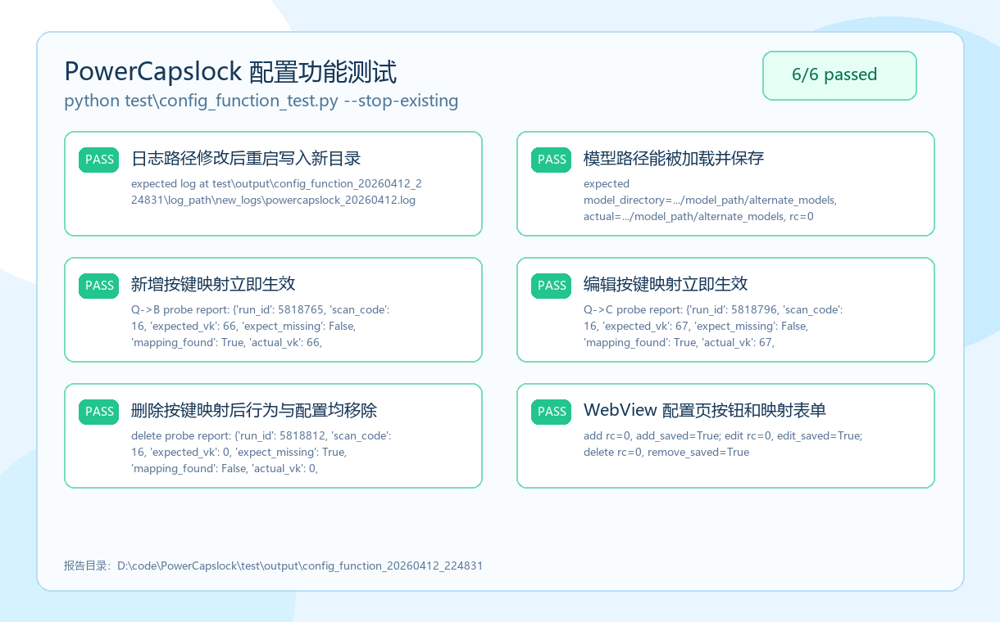

# PowerCapslock

PowerCapslock 是一个 Windows 键盘增强工具，把 CapsLock 改造成高效修饰键，并提供本地离线语音输入能力。

## 功能特性

- **CapsLock 快捷映射**：按住 CapsLock 后配合 H/J/K/L、I/O、U/P、数字键等触发方向键、Home/End、PageUp/PageDown、F1-F12。
- **可视化配置页面**：基于 WebView2 的现代化中文配置页，可修改日志目录、模型目录和按键映射。
- **配置即时生效**：按键映射保存后立即更新；模型路径保存时会立即检测并热加载，无需重启。
- **本地语音输入**：`CapsLock + A` 触发离线语音转文字，基于 sherpa-onnx + SenseVoice。
- **系统托盘控制**：托盘菜单支持启用、禁用、查看日志、打开配置页面。
- **现代提示窗**：语音听写、启用、禁用状态使用小型半透明提示窗。
- **日志与测试覆盖**：配置页按钮、日志路径、模型路径、按键映射增删改均有功能测试覆盖。

## 快速开始

1. 从 [GitHub Releases](https://github.com/IamJohnRain/PowerCapslock/releases) 下载最新主程序包。
2. 解压 `PowerCapslock-v0.2.0-windows-x64.zip` 到任意目录。
3. 运行 `powercapslock.exe`。
4. 右键系统托盘图标，选择“配置”打开配置页面。
5. 如需语音输入，另行下载 release 中的模型包，并在配置页选择模型目录。

## 配置页面

配置不再需要手写 JSON。打开托盘菜单中的“配置”即可修改路径和按键映射。



配置文件仍保存在当前用户目录，便于备份和迁移：

- 配置文件：`%USERPROFILE%\.PowerCapslock\config\config.json`
- 默认日志目录：`%USERPROFILE%\.PowerCapslock\logs`
- 配置页面资源：`resources/config_ui.html`

配置页保存行为：

- 修改日志目录后，新日志会写入保存后的目录。
- 修改模型目录后，程序会立即检测 SenseVoice 模型是否可用。
- 模型可用时会立即热加载并弹窗提示成功，不需要重启。
- 模型不可用时会弹窗说明原因，例如目录不存在、缺少 `model.onnx` 或 `tokens.txt`。
- 快捷映射支持新增、编辑、删除和恢复默认。

## 语音模型

主程序包不包含模型文件。语音模型来自 [FunAudioLLM/SenseVoice](https://github.com/FunAudioLLM/SenseVoice)，已作为单独 release 资产发布。

推荐使用方式：

1. 下载 `PowerCapslock-v0.2.0-model-SenseVoice-Small.zip`。
2. 解压到程序目录或任意固定目录。
3. 在配置页选择模型目录。
4. 保存后等待弹窗提示 `SenseVoice-Small 模型加载成功`。
5. 按住 `CapsLock + A` 开始听写，松开后自动输入识别结果。

模型目录支持选择以下任意层级：

- `models`
- `models\SenseVoice-Small`
- `models\SenseVoice-Small\sherpa-onnx-sense-voice-zh-en-ja-ko-yue-2024-07-17`

最终目录中必须能找到：

- `model.onnx`
- `tokens.txt`

## 项目结构

```text
PowerCapslock/
├── src/
│   ├── main.c                    # 程序入口、命令行测试入口
│   ├── hook.c / hook.h           # 低级键盘钩子、CapsLock 组合键处理
│   ├── keymap.c / keymap.h       # 按键映射表和映射查找
│   ├── tray.c / tray.h           # 系统托盘、启用/禁用提示窗
│   ├── config.c / config.h       # 用户配置读写与默认值
│   ├── config_dialog_webview.cpp # WebView2 配置窗口和保存逻辑
│   ├── voice.c / voice.h         # SenseVoice 模型检测、热加载、识别
│   ├── audio.c / audio.h         # WASAPI 音频采集
│   ├── voice_prompt.c / .h       # 语音听写提示窗
│   ├── keyboard_layout.c / .h    # 物理键位与布局处理
│   └── logger.c / logger.h       # 日志系统
├── resources/
│   ├── config_ui.html            # 配置页 HTML/CSS/JS
│   ├── icon.ico
│   ├── icon_disabled.ico
│   └── resource.rc
├── lib/
│   ├── sherpa-onnx-v1.12.36-win-x64-shared-MT-Release/
│   └── webview2/                 # WebView2 头文件和 WebView2Loader.dll
├── models/                       # 本地开发用模型目录，release 主包不包含模型
├── scripts/
│   ├── build.bat                 # 推荐构建脚本，会先停止单例进程
│   ├── package_release.ps1       # release 打包脚本
│   ├── install.bat
│   └── uninstall.bat
├── test/
│   ├── config_function_test.py   # 配置页、日志路径、模型路径、映射增删改测试
│   └── output/                   # 测试报告输出目录
├── docs/
│   └── images/                   # README 截图素材
├── CMakeLists.txt
└── README.md
```

## 构建

### 环境要求

- Windows 10/11
- CMake 3.10+
- MinGW-w64 或 Visual Studio C++ Build Tools
- Python 3.8+，用于运行测试
- 本仓库中的 `lib/webview2` 与 `lib/sherpa-onnx-v1.12.36-win-x64-shared-MT-Release`

### 推荐构建方式

软件是单例运行的。重新构建前需要停止已有进程，`scripts\build.bat` 已经内置这个步骤。

```bat
cd /d D:\code\PowerCapslock
scripts\build.bat
```

构建成功后输出：

```text
build\powercapslock.exe
build\resources\config_ui.html
build\WebView2Loader.dll
build\onnxruntime.dll
build\sherpa-onnx-c-api.dll
build\sherpa-onnx-cxx-api.dll
```

### 手动构建方式

```bat
cd /d D:\code\PowerCapslock

taskkill /IM powercapslock.exe /F 2>NUL
cmake -S . -B build -G "MinGW Makefiles" -DCMAKE_BUILD_TYPE=Release
cmake --build build --config Release --parallel
```

如果使用 MSVC，请在 “Developer Command Prompt for VS” 中执行：

```bat
cd /d D:\code\PowerCapslock

taskkill /IM powercapslock.exe /F 2>NUL
cmake -S . -B build -DCMAKE_BUILD_TYPE=Release
cmake --build build --config Release --parallel
```

## 测试

跑测试前同样要停止单例进程。配置功能测试会自动备份并恢复当前用户配置。

```bat
taskkill /IM powercapslock.exe /F 2>NUL
python test\config_function_test.py --stop-existing
```

本次 README 更新时重新运行的配置功能测试结果如下：



常用验证命令：

```bat
build\powercapslock.exe --test-model-load D:\code\PowerCapslock\models
build\powercapslock.exe --test-voice-prompt
build\powercapslock.exe --test-toast
```

测试覆盖：

- 日志路径修改后重启写入新目录。
- 模型路径读取、保存和命令行加载验证。
- 快捷映射新增、编辑、删除后行为立即生效。
- WebView 配置页浏览按钮、保存按钮、映射表单交互。

## Release 打包

正式 release 主程序包不包含模型文件。模型需作为单独资产发布。

主程序包应包含：

- `powercapslock.exe`
- `resources/config_ui.html`
- `WebView2Loader.dll`
- `onnxruntime.dll`
- `onnxruntime_providers_shared.dll`
- `sherpa-onnx-c-api.dll`
- `sherpa-onnx-cxx-api.dll`
- 使用说明文件

模型包单独上传，并在 release note 中说明来源、使用方式和对 SenseVoice 项目的致谢。

## 技术架构

- Windows Low-level Keyboard Hook：处理 CapsLock 修饰键与快捷映射。
- WebView2：承载现代化配置页面。
- WASAPI：采集麦克风音频。
- sherpa-onnx + SenseVoice：本地离线语音识别。
- CMake：构建 C11 / C++17 混合项目。

## 致谢

- 语音模型来自 [FunAudioLLM/SenseVoice](https://github.com/FunAudioLLM/SenseVoice)。感谢 SenseVoice 项目及贡献者提供优秀的语音识别模型。
- 语音识别运行时基于 [sherpa-onnx](https://github.com/k2-fsa/sherpa-onnx)。
- 键位体验灵感来自 Vim 的高效移动方式。

## 许可证

MIT License
